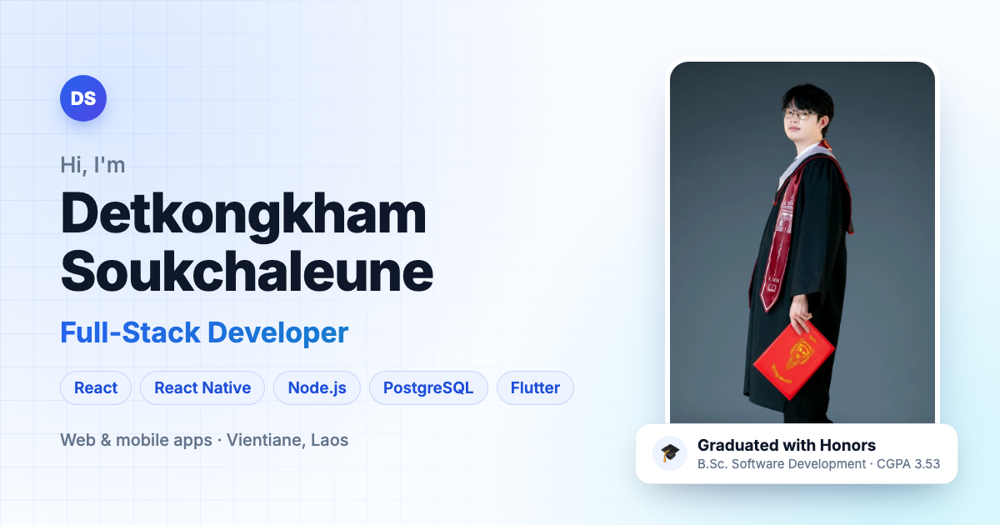

# Detkongkham Soukchaleune — Portfolio

**Live:** https://detkongkham.github.io · [Vercel mirror](https://detkongkham.vercel.app)

[](https://detkongkham.github.io)

Personal portfolio of a Full-Stack Developer from Vientiane, Laos. It is a bilingual (English / Lao) single-page site with dark mode, and it works on phones as well as desktops.

## Featured projects

| Project | Stack |
|---|---|
| **Aura Beauty & Clinic Platform**: web admin plus customer and staff mobile apps for beauty clinics | TypeScript, React, React Native (Expo), Node.js, PostgreSQL, Prisma, Redis, Socket.IO, Docker |
| **Car Repair Shop Management System**: desktop app for parts sales, repairs and payments (graduation project) | C#, SQL Server, Figma |
| **Beverage Sales App**: mobile ordering app with a REST API | Flutter, Node.js, Express, MySQL |

## Tech

- **Vite + React + TypeScript**
- **Tailwind CSS v4**: semantic color tokens, so light and dark mode share the same classes
- **motion**: scroll reveal animations, turned off when the visitor's system asks for reduced motion
- **yet-another-react-lightbox**: screenshot gallery, loaded only when a visitor opens it
- **Fonts**: Inter and Noto Sans Lao, self-hosted with Fontsource

Lighthouse scores are 92–100 on mobile and 100 in every category on desktop.

## Editing content

All text and images come from `src/data/` and `src/i18n/`. The components only render them.

| To change | Edit |
|---|---|
| Name, contact, social links | `src/data/profile.ts` |
| Projects and screenshots | `src/data/projects.ts` + `public/images/projects/<slug>/` |
| Skills | `src/data/skills.ts` |
| Experience and education | `src/data/experience.ts` |
| UI labels (EN / Lao) | `src/i18n/en.ts`, `src/i18n/lo.ts` |

Every project screenshot `name.webp` needs a smaller `name-sm.webp` next to it (640px wide, or 360px for phone screenshots). The cards show the small version and the lightbox shows the full one.

## Run locally

```bash
pnpm install
pnpm dev       # http://localhost:5173
pnpm build     # type-check and build to dist/
pnpm preview   # serve the build at http://localhost:4173
```

Every push to `main` is deployed to **GitHub Pages** and **Vercel** automatically.
